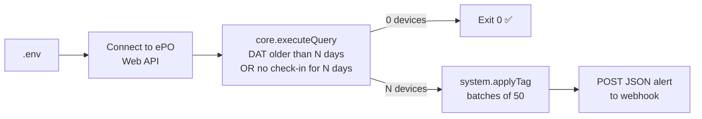

# 🛡️ Compliance Hunter

**Daily endpoint health & compliance check for Trellix ePO (formerly McAfee ePO).**
Finds endpoints with stale DAT signatures or no recent agent check-in, tags them in ePO, and pushes a JSON alert to your chat or SOAR webhook.

[](https://github.com/Murat-UGUR/compliance-hunter/actions/workflows/ci.yml)


> 🇹🇷 Türkçe özet [aşağıda](#-türkçe-özet).

---

## Why

Agents that stop updating are a quiet problem. Nothing alerts, the dashboard stays green, and the endpoint runs with week-old signatures. Compliance Hunter runs once a day and makes those endpoints **visible** (webhook alert) and **actionable** (an ePO tag you can target with policies, client tasks or queries).

## How it works



The query is sent in ePO's S-expression syntax:

```lisp
target = EPOLeafNode
select = (select EPOLeafNode.NodeName EPOComputerProperties.IPAddress
                 EPOLeafNode.LastUpdate EPOProdPropsView_VIRUSCAN.datdate)
where  = (where (or (olderThan EPOProdPropsView_VIRUSCAN.datdate 604800000)
                    (olderThan EPOLeafNode.LastUpdate        604800000)))
```

> ℹ️ `EPOLeafNode.LastUpdate` is the **last agent-to-server communication**, not the DAT date. The DAT date lives in the product properties table, which differs per product (VSE vs. ENS). That table is configurable.

## Quick start

```bash
git clone https://github.com/Murat-UGUR/compliance-hunter.git
cd compliance-hunter
pip install -r requirements.txt
cp .env.example .env        # fill in ePO URL, API user, webhook
python compliance_hunter.py --dry-run -v   # list only, changes nothing
python compliance_hunter.py                # tag + notify
```

Before the first real run, create the tag (`Outdated_DAT` by default) in **ePO → Tag Catalog**. The API can apply tags but cannot create them.

### Configuration (`.env`)

| Variable | Required | Default | Description |
|---|:-:|---|---|
| `EPO_URL` | ✅ | | e.g. `https://epo.corp.local:8443` |
| `EPO_USERNAME` / `EPO_PASSWORD` | ✅ | | Dedicated least-privilege API account |
| `WEBHOOK_URL` | ✅ | | Slack / Teams / Mattermost / SOAR endpoint |
| `EPO_VERIFY_SSL` | | `true` | `true`, `false` or path to a CA bundle |
| `STALE_DAYS` | | `7` | Threshold in days |
| `TAG_NAME` | | `Outdated_DAT` | Tag applied to non-compliant hosts |
| `DAT_TABLE` / `DAT_DATE_COLUMN` | | `EPOProdPropsView_VIRUSCAN` / `datdate` | Change for ENS. Find the right names with `core.listTables` |

### Exit codes (for cron / Task Scheduler / monitoring)

| Code | Meaning |
|:-:|---|
| 0 | Success (or nothing to do) |
| 1 | Partial failure: some tag batches failed, alert still sent |
| 2 | Configuration error |
| 3 | Cannot connect or authenticate to ePO |
| 4 | Query error (check table/column names) |
| 5 | Webhook delivery failed |

### Scheduling

```cron
# every day at 08:15
15 8 * * * cd /opt/compliance-hunter && /usr/bin/python3 compliance_hunter.py >> hunter.log 2>&1
```

## Webhook payload

```json
{
  "text": "⚠️ Dikkat: 52 cihaz 7 gündür DAT güncellemesi almıyor veya ePO ile haberleşmiyor. 52 cihaza 'Outdated_DAT' etiketi atandı.\n\n- WS-0037 | 10.10.0.38 | ...",
  "source": "Trellix ePO Compliance Hunter",
  "count": 52,
  "tagged": 52,
  "errors": [],
  "devices": [{"hostname": "WS-0037", "ip": "10.10.0.38", "last_communication": "...", "dat_date": "..."}]
}
```

`text` renders directly in chat tools. `devices` carries the full list for SIEM/SOAR ingestion.

## Testing without an ePO server

The test suite spins up a **mock ePO Web API**. It handles basic auth, security tokens, `OK:`/`Error` responses, `olderThan` filtering, column validation and the tag catalog. The suite runs against a simulated 202-host fleet, so CI needs no real ePO.

```bash
pip install -r requirements-dev.txt
pytest -v
```

Covered: happy path, 50-host batching, dry-run, missing tag, partial batch failure, wrong password, unreachable server, missing config, wrong column, webhook failure, `.env` overrides.

## Known limitations

- Hosts **without** the AV product report an empty DAT date and are only caught by the check-in condition. Add `(isBlank <DAT column>)` to the `where` clause if you want them flagged too.
- Table and column names vary between ePO / ENS versions. Verify them with `https://<epo>:8443/remote/core.listTables` before the first run.

## 🇹🇷 Türkçe özet

Trellix ePO'da **N gündür DAT güncellemesi almamış** veya **ePO ile haberleşmemiş** cihazları bulur, onlara `Outdated_DAT` etiketini atar ve listeyi JSON olarak Webhook'a gönderir. İlk çalıştırmada `--dry-run` kullanın. Etiketi önceden ePO Tag Catalog'da oluşturun. ENS kullanıyorsanız `DAT_TABLE` ve `DAT_DATE_COLUMN` değerlerini `core.listTables` çıktısına göre ayarlayın.

## License

MIT © Murat UĞUR
